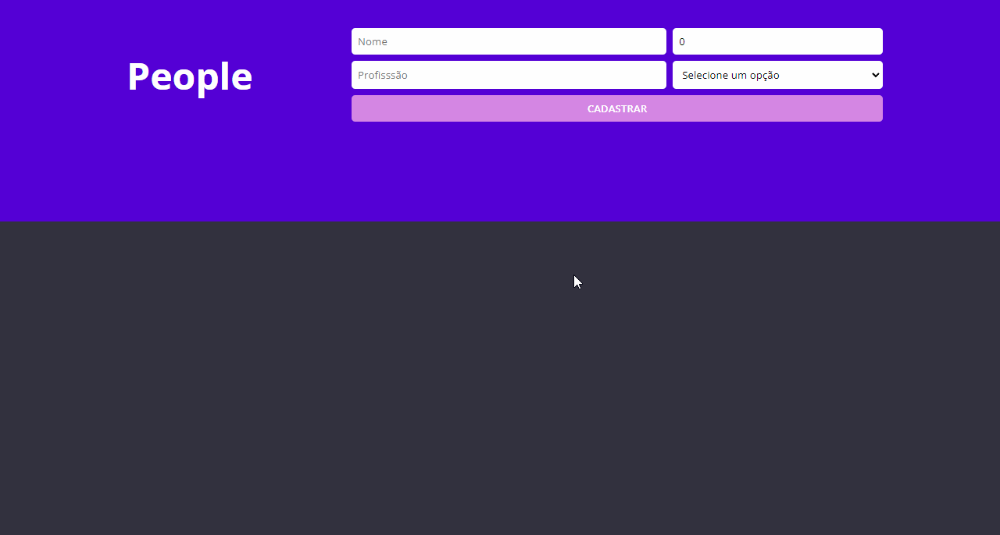

# People API

Projeto pessoal utilizando ReactJS no front e NodeJS no back. Aplicação simples de cadastro de pessoas, armazenando-as no banco de dados SQLite e fornecendo os dados para o usuário por meio de API construída com Express.

## ✨ Preview

## 🛠 Builded with

##  About me

- 👤 Bacharel em jornalismo se aventurando pelo mundo da programação, estudando stacks relacionadas ao front-end, focado em ReactJS

- 🔭 Me encontre:  
